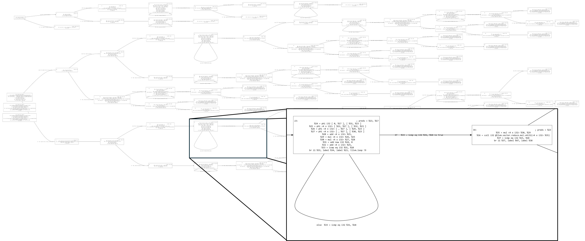

# $EVA$（ $Escape$ $Variable$ $Analyzer$ ）

$EVA$ is a project which implemented a $\text{Graal Partial Escape Analysis(PEA)}$ analyzer for LLVM IR. It is originally a part of the project [PPLForge](https://github.com/FSMargoo/PPLForge).

$EVA$ provides both a C++ API and an executable file like the $\text{opt.exe}$ in $LLVM$.

So far, $EVA$ is still underdeveloping. And further documentation and code are still needed to be finished.

$EVA$ dose not provide a $LLVM$ pass.

## How it work?

$EVA$ starts with the CFG construction: Based on the LLVM IR instruction, $EVA$ will generate a CFG for the variable usage analyzing.

